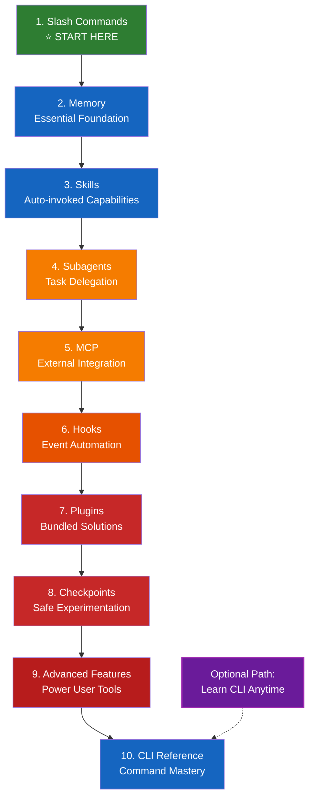

<picture>
  <source media="(prefers-color-scheme: dark)" srcset="resources/logos/claude-howto-logo-dark.svg">
  
</picture>

# 📚 Claude Code Learning Roadmap

**New to Claude Code?** This comprehensive guide will help you master Claude Code features progressively, starting with the simplest and most frequently used capabilities.

---

## 🎯 Learning Philosophy

The folders in this repository are numbered in **recommended learning order** based on three key principles:

1. **Dependencies** - Foundational concepts come first
2. **Complexity** - Easier features before advanced ones
3. **Frequency of Use** - Most common features taught early

This approach ensures you build a solid foundation while gaining immediate productivity benefits.

---

## 🗺️ Your Learning Path



**Color Legend:**
- 🟢 Green: Beginner - Start here!
- 🔵 Light Blue: Beginner+ - Essential foundations
- 🟡 Gold: Intermediate - Common usage
- 🟠 Orange: Intermediate-Advanced - Specialized
- 🔴 Red: Advanced - Power user features
- 🔴 Dark Red: Most Advanced - Expert territory
- 💜 Purple (Dotted): Optional - Can learn anytime

---

## 📊 Complete Roadmap Table

| Step | Feature | Complexity | Time | Dependencies | Why Learn This | Key Benefits |
|------|---------|-----------|------|--------------|----------------|--------------|
| **1** | [Slash Commands](01-slash-commands/) | ⭐ Beginner | 30 min | None | Quick productivity wins | Instant automation, team standards |
| **2** | [Memory](02-memory/) | ⭐⭐ Beginner+ | 45 min | None | Essential for all features | Persistent context, preferences |
| **3** | [Skills](03-skills/) | ⭐⭐ Intermediate | 1 hour | Slash Commands | Automatic expertise | Reusable capabilities, consistency |
| **4** | [Subagents](04-subagents/) | ⭐⭐⭐ Intermediate+ | 1.5 hours | Memory, Commands | Complex task handling | Delegation, specialized expertise |
| **5** | [MCP](05-mcp/) | ⭐⭐⭐ Intermediate+ | 1 hour | Configuration | Live data access | Real-time integration, APIs |
| **6** | [Hooks](06-hooks/) | ⭐⭐ Intermediate | 1 hour | Tools, Commands | Workflow automation | Validation, quality gates |
| **7** | [Plugins](07-plugins/) | ⭐⭐⭐⭐ Advanced | 2 hours | All previous | Complete solutions | Team onboarding, distribution |
| **8** | [Checkpoints](08-checkpoints/) | ⭐⭐ Intermediate | 45 min | Session management | Safe exploration | Experimentation, recovery |
| **9** | [Advanced Features](09-advanced-features/) | ⭐⭐⭐⭐⭐ Advanced | 2-3 hours | All previous | Power user tools | Planning, headless, permissions |
| **10** | [CLI Reference](10-cli/) | ⭐⭐ Beginner+ | 1 hour | Recommended: All | Master command-line usage | Scripting, CI/CD, automation, batch processing |

**Total Learning Time**: ~11-13 hours (spread across 4-5 weeks recommended)

**Note on CLI Reference (Lesson 10)**: While numbered as lesson 10, the CLI Reference can be learned anytime! It covers command-line usage which is independent of other features. Many learners find it useful to learn early for scripting, while others prefer to master the UI features first and then learn CLI for advanced automation.

---

## 🎯 Learning Milestones

### Milestone 1: Essential Productivity (Week 1)

**Topics**: Slash Commands + Memory
**Time**: 1-2 hours
**Complexity**: ⭐ Beginner
**Goal**: Immediate productivity boost with custom commands and persistent context

#### What You'll Achieve
✅ Create custom slash commands for repetitive tasks
✅ Set up project memory for team standards
✅ Configure personal preferences
✅ Understand how Claude loads context automatically

#### Hands-on Exercises

```bash
# Exercise 1: Install your first slash command
mkdir -p .claude/commands
cp 01-slash-commands/optimize.md .claude/commands/

# Exercise 2: Create project memory
cp 02-memory/project-CLAUDE.md ./CLAUDE.md

# Exercise 3: Try it out
# In Claude Code, type: /optimize
```

#### Success Criteria
- [ ] Successfully invoke `/optimize` command
- [ ] Claude remembers your project standards from CLAUDE.md
- [ ] You understand when to use slash commands vs. memory

#### Next Steps
Once comfortable, read:
- [01-slash-commands/README.md](01-slash-commands/README.md)
- [02-memory/README.md](02-memory/README.md)

---

### Milestone 2: Automation (Week 2)

**Topics**: Skills + Hooks
**Time**: 2-3 hours
**Complexity**: ⭐⭐ Intermediate
**Goal**: Automate common workflows and quality checks

#### What You'll Achieve
✅ Auto-invoke specialized capabilities
✅ Set up event-driven automation
✅ Enforce code quality standards
✅ Create custom hooks for your workflow

#### Hands-on Exercises

```bash
# Exercise 1: Install a skill
cp -r 03-skills/code-review ~/.claude/skills/

# Exercise 2: Set up hooks
mkdir -p ~/.claude/hooks
cp 06-hooks/pre-tool-check.sh ~/.claude/hooks/
chmod +x ~/.claude/hooks/pre-tool-check.sh

# Exercise 3: Configure hooks in settings
# Add to ~/.claude/settings.json:
{
  "hooks": {
    "PreToolUse": [
      {
        "matcher": "Bash",
        "hooks": [
          {
            "type": "command",
            "command": "~/.claude/hooks/pre-tool-check.sh"
          }
        ]
      }
    ]
  }
}
```

#### Success Criteria
- [ ] Code review skill automatically invoked when relevant
- [ ] PreToolUse hook runs before tool execution
- [ ] You understand skill auto-invocation vs. hook event triggers

#### Next Steps
- Create your own custom skill
- Set up additional hooks for your workflow
- Read: [03-skills/README.md](03-skills/README.md)
- Read: [06-hooks/README.md](06-hooks/README.md)

---

### Milestone 3: Advanced Integration (Week 3-4)

**Topics**: Subagents + MCP + Plugins
**Time**: 4-5 hours
**Complexity**: ⭐⭐⭐ Intermediate-Advanced
**Goal**: Integrate external services and delegate complex tasks

#### What You'll Achieve
✅ Delegate work to specialized AI agents
✅ Access live data from GitHub, databases, etc.
✅ Install complete bundled solutions
✅ Understand when to use each integration type

#### Hands-on Exercises

```bash
# Exercise 1: Set up GitHub MCP
export GITHUB_TOKEN="your_github_token"
claude mcp add github -- npx -y @modelcontextprotocol/server-github

# Exercise 2: Test MCP integration
# In Claude Code: /mcp__github__list_prs

# Exercise 3: Install subagents
mkdir -p .claude/agents
cp 04-subagents/*.md .claude/agents/

# Exercise 4: Install a complete plugin
# In Claude Code: /plugin install pr-review
```

#### Success Criteria
- [ ] Successfully query GitHub data via MCP
- [ ] Claude delegates complex tasks to subagents
- [ ] You've installed and used a plugin
- [ ] You understand the difference between MCP, subagents, and plugins

#### Integration Exercise
Try this complete workflow:
1. Use MCP to fetch a GitHub PR
2. Let Claude delegate review to code-reviewer subagent
3. Use hooks to run tests automatically
4. See how the plugin bundles everything together

#### Next Steps
- Set up additional MCP servers (database, Slack, etc.)
- Create custom subagents for your domain
- Read: [04-subagents/README.md](04-subagents/README.md)
- Read: [05-mcp/README.md](05-mcp/README.md)
- Read: [07-plugins/README.md](07-plugins/README.md)

---

### Milestone 4: Power User (Week 5+)

**Topics**: Checkpoints + Advanced Features
**Time**: 3-4 hours
**Complexity**: ⭐⭐⭐⭐⭐ Advanced
**Goal**: Master advanced workflows and experimentation

#### What You'll Achieve
✅ Safe experimentation with checkpoints
✅ Planning mode for complex features
✅ Print mode (`claude -p`) for CI/CD automation
✅ Fine-grained permission control (default, acceptEdits, plan, dontAsk, bypassPermissions)
✅ Background task management
✅ Auto Memory for learned preferences
✅ Extended thinking via Alt+T / Option+T toggle

#### Hands-on Exercises

```bash
# Exercise 1: Try checkpoint workflow
# In Claude Code:
# Make some experimental changes, then press Esc+Esc or use /rewind
# Select the checkpoint before your experiment
# Choose "Restore code and conversation" to go back

# Exercise 2: Use planning mode
/plan Implement user authentication system

# Exercise 3: Try print mode (non-interactive)
claude -p "Run all tests and generate report"

# Exercise 4: Try permission modes
claude --permission-mode plan "analyze this codebase"
claude --permission-mode acceptEdits "refactor the auth module"

# Exercise 5: Enable extended thinking
# Press Alt+T (Option+T on macOS) during a session to toggle
```

#### Success Criteria
- [ ] Created and reverted to a checkpoint
- [ ] Used planning mode for a complex feature
- [ ] Ran Claude Code in print mode (`claude -p`)
- [ ] Configured permission modes (plan, acceptEdits, dontAsk)
- [ ] Used background tasks for long operations
- [ ] Toggled extended thinking with Alt+T / Option+T

#### Advanced Exercise
Complete this end-to-end workflow:
1. Create checkpoint "Clean state"
2. Use planning mode to design a feature
3. Implement with subagent delegation
4. Run tests in background
5. If tests fail, rewind to checkpoint
6. Try alternative approach
7. Use print mode (`claude -p`) in CI/CD

#### Next Steps
- Set up CI/CD integration
- Create custom configuration for your team
- Read: [08-checkpoints/README.md](08-checkpoints/README.md)
- Read: [09-advanced-features/README.md](09-advanced-features/README.md)

---

### Milestone 5: CLI Mastery (Learn Anytime!)

**Topics**: CLI Reference
**Time**: 1 hour
**Complexity**: ⭐⭐ Beginner+
**Goal**: Master command-line usage for scripting and automation

**When to Learn**: This can be learned anytime - either early for scripting needs, or later as part of your power user journey. CLI is independent of other features!

#### What You'll Achieve
✅ Understand all CLI commands and flags
✅ Use print mode for non-interactive scripting
✅ Integrate Claude Code into CI/CD pipelines
✅ Process files and logs via piping
✅ Configure custom agents via CLI
✅ Automate batch processing tasks
✅ Master session management and resumption

#### Hands-on Exercises

```bash
# Exercise 1: Interactive vs Print mode
claude "explain this project"           # Interactive mode
claude -p "explain this function"       # Print mode (non-interactive)

# Exercise 2: Process file content via piping
cat error.log | claude -p "explain this error"
cat schema.sql | claude -p "suggest optimizations"

# Exercise 3: JSON output for scripts (great for CI/CD)
claude -p --output-format json "list all functions"

# Exercise 4: Session management and resumption
claude -r "feature-auth" "continue implementation"
claude -r "code-review" "finalize suggestions"

# Exercise 5: CI/CD integration with constraints
claude -p --max-turns 3 --output-format json "review code"

# Exercise 6: Batch processing
for file in *.md; do
  claude -p --output-format json "summarize this: $(cat $file)" > ${file%.md}.summary.json
done
```

#### Success Criteria
- [ ] Used print mode for non-interactive queries
- [ ] Piped file content to Claude for analysis
- [ ] Generated JSON output for scripting
- [ ] Resumed a previous session successfully
- [ ] Understood permission and tool flags
- [ ] Created a simple shell script using Claude CLI
- [ ] Integrated Claude into a CI/CD workflow

#### CLI Integration Exercise
Create a simple CI/CD script:
1. Use `claude -p` to review changed files
2. Output results as JSON
3. Process with `jq` for specific issues
4. Integrate into GitHub Actions workflow

#### Real-World Use Cases for CLI
- **Code Review Automation**: Run code reviews in CI/CD pipelines
- **Log Analysis**: Analyze error logs and system outputs
- **Documentation Generation**: Batch generate documentation
- **Testing Insights**: Analyze test failures
- **Performance Analysis**: Review performance metrics
- **Data Processing**: Transform and analyze data files

#### Next Steps
- Create shell aliases for common commands
- Set up batch processing scripts
- Integrate with your existing CI/CD pipeline
- Create team-wide CLI shortcuts
- Read: [10-cli/README.md](10-cli/README.md)

---

## ⚡ Quick Start Paths

### If You Only Have 15 Minutes
**Goal**: Get your first win

1. Copy one slash command: `cp 01-slash-commands/optimize.md .claude/commands/`
2. Try it in Claude Code: `/optimize`
3. Read: [01-slash-commands/README.md](01-slash-commands/README.md)

**Outcome**: You'll have a working slash command and understand the basics

---

### If You Have 1 Hour
**Goal**: Set up essential productivity tools

1. **Slash commands** (15 min): Copy and test `/optimize` and `/pr`
2. **Project memory** (15 min): Create CLAUDE.md with your project standards
3. **Install a skill** (15 min): Set up code-review skill
4. **Try them together** (15 min): See how they work in harmony

**Outcome**: Basic productivity boost with commands, memory, and auto-skills

---

### If You Have a Weekend
**Goal**: Become proficient with most features

**Saturday Morning** (3 hours):
- Complete Milestone 1: Slash Commands + Memory
- Complete Milestone 2: Skills + Hooks

**Saturday Afternoon** (3 hours):
- Complete Milestone 3: Subagents + MCP
- Install and explore plugins
- *Optional*: Learn CLI basics for scripting

**Sunday** (4 hours):
- Complete Milestone 4: Checkpoints + Advanced Features
- Build a custom plugin for your team
- Set up complete CI/CD workflow with CLI
- Advanced CLI integration for CI/CD pipelines

**Outcome**: You'll be a Claude Code power user ready to train others and automate complex workflows

---

## 💡 Learning Tips

### ✅ Do

- **Follow the numbered order** (01 → 02 → 03...)
- **Complete hands-on exercises** for each topic
- **Start simple** and add complexity gradually
- **Test each feature** before moving to the next
- **Take notes** on what works for your workflow
- **Refer back** to earlier concepts as you learn advanced topics
- **Experiment safely** using checkpoints
- **Share knowledge** with your team

### ❌ Don't

- **Skip directly to advanced features** - you'll miss foundations
- **Try to learn everything at once** - it's overwhelming
- **Copy configurations without understanding them** - you won't know how to debug
- **Forget to test** - always verify features work
- **Rush through milestones** - take time to understand
- **Ignore the documentation** - each README has valuable details
- **Work in isolation** - discuss with teammates

---

## 🎓 Learning Styles

### Visual Learners
- Study the mermaid diagrams in each README
- Watch the command execution flow
- Draw your own workflow diagrams
- Use the visual learning path above

### Hands-on Learners
- Complete every hands-on exercise
- Experiment with variations
- Break things and fix them
- Create your own examples

### Reading Learners
- Read each README thoroughly
- Study the code examples
- Review the comparison tables
- Read the blog posts linked in resources

### Social Learners
- Set up pair programming sessions
- Teach concepts to teammates
- Join Claude Code community discussions
- Share your custom configurations

---

## 📈 Progress Tracking

Use this checklist to track your progress:

### Week 1: Foundations
- [ ] Completed 01-slash-commands
- [ ] Completed 02-memory
- [ ] Created first custom slash command
- [ ] Set up project memory
- [ ] Milestone 1 achieved

### Week 2: Automation
- [ ] Completed 03-skills
- [ ] Completed 06-hooks
- [ ] Installed first skill
- [ ] Set up PreToolUse hook
- [ ] Milestone 2 achieved

### Week 3-4: Integration
- [ ] Completed 04-subagents
- [ ] Completed 05-mcp
- [ ] Completed 07-plugins
- [ ] Connected GitHub MCP
- [ ] Created custom subagent
- [ ] Installed plugin
- [ ] Milestone 3 achieved

### Week 5+: Mastery
- [ ] Completed 08-checkpoints
- [ ] Completed 09-advanced-features
- [ ] Used planning mode successfully
- [ ] Set up print mode (`claude -p`) CI/CD
- [ ] Configured permission modes
- [ ] Used extended thinking toggle
- [ ] Created team plugin
- [ ] Milestone 4 achieved

### Optional: CLI Mastery (Learn Anytime)
- [ ] Completed 10-cli reference
- [ ] Used CLI print mode for scripting
- [ ] Piped files to Claude for analysis
- [ ] Created JSON output for automation
- [ ] Integrated Claude into CI/CD pipeline
- [ ] Used session resumption for workflows
- [ ] Milestone 5 achieved

---

## 🆘 Common Learning Challenges

### Challenge 1: "Too many concepts at once"
**Solution**: Focus on one milestone at a time. Complete all exercises before moving forward.

### Challenge 2: "Don't know which feature to use when"
**Solution**: Refer to the [Use Case Matrix](README.md#use-case-matrix) in the main README.

### Challenge 3: "Configuration not working"
**Solution**: Check the [Troubleshooting](README.md#troubleshooting) section and verify file locations.

### Challenge 4: "Concepts seem to overlap"
**Solution**: Review the [Feature Comparison](README.md#feature-comparison) table to understand differences.

### Challenge 5: "Hard to remember everything"
**Solution**: Create your own cheat sheet. Use checkpoints to experiment safely.

---

## 🎯 What's Next After Completion?

Once you've completed all milestones:

1. **Create team documentation** - Document your team's Claude Code setup
2. **Build custom plugins** - Package your team's workflows
3. **Explore Remote Control** - Control Claude Code sessions programmatically from external tools
4. **Try Web Sessions** - Use Claude Code through browser-based interfaces for remote development
5. **Use the Desktop App** - Access Claude Code features through the native desktop application
6. **Leverage Auto Memory** - Let Claude learn your preferences automatically over time
7. **Contribute examples** - Share with the community
8. **Mentor others** - Help teammates learn
9. **Optimize workflows** - Continuously improve based on usage
10. **Stay updated** - Follow Claude Code releases and new features

---

## 📚 Additional Resources

### Official Documentation
- [Claude Code Documentation](https://docs.anthropic.com/en/docs/claude-code)
- [Anthropic Documentation](https://docs.anthropic.com)
- [MCP Protocol Specification](https://modelcontextprotocol.io)

### Blog Posts
- [Discovering Claude Code Slash Commands](https://medium.com/@luongnv89/discovering-claude-code-slash-commands-cdc17f0dfb29)

### Community
- [Anthropic Cookbook](https://github.com/anthropics/anthropic-cookbook)
- [MCP Servers Repository](https://github.com/modelcontextprotocol/servers)

---

## 💬 Feedback & Support

- **Found an issue?** Create an issue in the repository
- **Have a suggestion?** Submit a pull request
- **Need help?** Check the documentation or ask the community

---

**Last Updated**: February 2026
**Maintained by**: Claude How-To Contributors
**License**: Educational purposes, free to use and adapt

---

[← Back to Main README](README.md)
